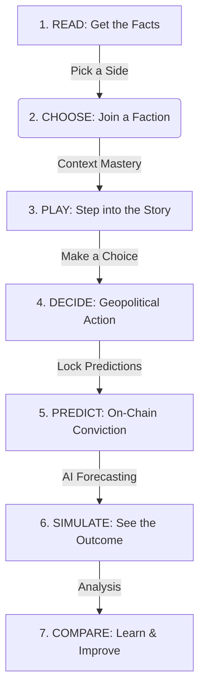

# 🧭 Plot the News!: Turning News into Action

[](https://nextjs.org/)
[](https://tailwindcss.com/)
[](http://139.180.140.143/)
[](https://nottshack.com)

**Plot the News! turns real-world headlines into interactive geopolitical simulation games. Move beyond passive scrolling: read an editorial, pick a faction, live a visual novel narrative, lock your prediction on-chain, and watch an AI-simulated future unfold.**

---

## 🏛️ How it Works: The 7-Step Experience Loop

Plot the News! helps you learn world affairs by taking you through a structured cycle, moving from facts to real-world consequences:



---

## 🔥 Why Plot the News!?
Plot the News! is the intersection of **News + Simulation + Social + AI**. It turns the raw news into a **Playable Geopolitical Game** that subverts the fast-scrolling **System 1** architecture of modern social media, grounding users in deep, analytical **System 2** thinking.

## ✨ The Four Pillars

*   **📰 Spotting the Truth**: Move beyond "fast news" and emotional reactions. Use multi-perspective news to rebuild your understanding of global reality.
*   **🎮 Learning by Doing**: Stop scrolling and start participating. Live the news through interactive narratives that help you understand the human side of politics.
*   **🤖 Seeing the Future**: Our AI builds real models of the world. Use our tools to see how one event (like a trade tax) can cascade into long-term global shifts.
*   **📈 Making the Truth Matter**: Filter out the noise. Lock your predictions on-chain to build a **Verifiable Track Record** that rewards you for being right, not just being loud.

---

## 🚀 Getting Started

### 1. Clone & Install
```bash
git clone https://github.com/Minhen/Plot-the-News.git
cd Plot-the-News
pnpm install
```

### 2. Environment Setup
Create a `.env.local` file (see [.env.example](.env.example) for details):
- `DATABASE_URL`: Supabase Transaction Pooler (Port 6543).
- `DIRECT_URL`: Supabase Direct Connection (Port 5432).
- `DEEPSEEK_API_KEY`: For story & scenario generation.
- `FAL_KEY`: For on-demand AI image generation.
- `GENERATE_IMAGES`: `false` (dev) / `true` (prod).
- `NEWSDATA_API_KEY` & `GNEWS_API_KEY`: Real-time news feeds.
- `NEXT_PUBLIC_PRIVY_APP_ID`: Web3 Auth.

### 3. Database & Development
This project uses a custom schema named **`plot_news_app`** to isolate its data.

```bash
# 1. Verify your database connections (Safe for Windows)
node scripts/db-check.mjs

# 2. Sync schema (Non-destructive)
npm run db:push

# 3. Start development
npm run dev
```

---

## ⚙️ Technical Operations & Data Flow

Plot the News! uses a sophisticated three-stage intelligence pipeline to transform raw media into interactive dossiers.

### 1. The Ingestion Phase (Raw News)
- **Source**: We fetch the latest global headlines from **NewsData.io**.
- **Manual Trigger**: Use the **"Sync Global News"** button at the bottom-right of the dashboard to scan for new events immediately.
- **Automation**: A cron job runs every 3 hours to keep the feed fresh.

### 2. The Narration Phase (AI Intelligence)
- **DeepSeek Engine**: For every new article, the AI scrapes the full text, analyzes the geopolitical stakes, and generates:
  - An updated **Editorial Article**.
  - Two competing **Faction Roles**.
  - A **Visual Novel Script** (Panels & Dialogue).
- **Storage**: All content is isolated in the `plot_news_app` schema to ensure data integrity.

### 3. The Visualization Phase (On-Demand Art)
- **Placeholders**: To optimize speed, new stories are initially stored with **Picsum placeholders**.
- **On-Demand Generation**: When you enter the "Play" mode for a story with placeholders, the system will ask: *"This dossier lacks visual data. Generate custom AI comic panels now?"*
- **FAL.ai Rendering**: If you approve, **FAL.ai (Flux Schnell)** renders custom backgrounds and portraits on-the-fly, which are then permanently saved to your database.

---

## 🛠️ Tech Stack

| Layer                                         | Technology                             |
| --------------------------------------------- | -------------------------------------- |
| Frontend + API                                | Next.js 15 (App Router)                |
| Styling                                       | Tailwind CSS v4                        |
| ORM                                           | Drizzle ORM                            |
| Database                                      | Supabase (Postgres)                    |
| AI — story generation                         | DeepSeek (`deepseek-chat`)             |
| AI — image generation                         | FAL.ai (Flux Schnell + Flux Pro Redux) |
| News — cron job / fallback for live home feed | newsdata.io                            |
| News — story references                       | GNews API v4                           |
| Article scraping                              | Mozilla Readability + jsdom            |
| Auth / Wallet                                 | Privy                                  |
| Blockchain                                    | DCAI L3 Testnet                        |

---

## 📂 Project Structure

```
src/
  app/
    page.tsx                          # Plot the News Hub
    story/[id]/
      page.tsx                        # Article View
      role/page.tsx                   # Role Selection
      play/page.tsx                   # Visual Novel
      predict/page.tsx                # Community Directives
      outcome/page.tsx                # Simulation Outcome
  db/
    schema.ts                         # Custom schema: plot_news_app
  lib/
    generate/                         # AI Story & Image Generation
    newsdata.ts                       # newsdata.io fetch functions
    predictions.ts                    # DB prediction logic
    stories.ts                        # DB story CRUD
scripts/
  db-check.mjs                        # Universal DB diagnostic tool
drizzle/
  manual/                             # Manual repair scripts
```

---

## 📚 Learn the Philosophy

Explore our foundational guides:
1. [🔭 **The Vision**](docs/foundations/01-vision.md): Why we need to move from scrolling to solving.
2. [📰 **Spotting the Truth**](docs/foundations/02-media_verification.md): How we fight media bias and misinformation.
3. [🎮 **Learning by Doing**](docs/foundations/03-immersive_learning.md): Turning passive readers into active stakeholders.
4. [🤖 **Seeing the Future**](docs/foundations/04-ai_simulation.md): Understanding the ripple effects of global news.
5. [📈 **Making the Truth Matter**](docs/foundations/05-prediction_markets.md): The economics of belief and the search for facts.
6. [👤 **Building Your Brand**](docs/foundations/06-identity_reputation.md): Creating an intellectual resume for the professional world.

---

*Built with ❤️ for NottsHack 2026. Empowering the next generation to shape the future.*
