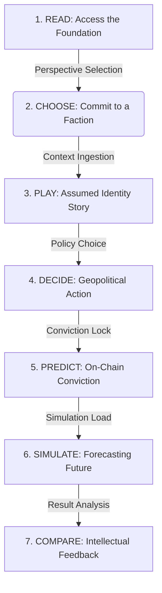

# 🔭 FutureLens: The Civic Simulation Layer

[](https://nextjs.org/)
[](https://tailwindcss.com/)
[](http://139.180.140.143/)
[](https://nottshack.com)

**FutureLens is more than a news platform. It is a civic simulation layer where people don’t just consume news—but simulate it, challenge it, and learn from the consequences of their decisions. We help the next generation reclaim their intellectual agency in an era of epistemic fragmentation.**

---

## 🏛️ The Architecture of Participation
FutureLens bridges the gap between fragmented social feeds and real-world political agency through a structured 7-step pedagogical cycle designed to foster critical literacy and foresight:



---

## 🔥 Unique Value Proposition
FutureLens sits at the intersection of **News + Simulation + Social + AI**. It transforms the raw data of the world into a **Playable Geopolitical Experience**. By subverting the fast-scrolling "System 1" architecture of modern social media, we ground users in deep, analytical "System 2" thinking.

## 📚 Foundational Principles

### 📰 [Epistemic Resilience](docs/foundations/02-media_verification.md)
Move beyond "fact-checking." Deconstruct bias with **Strategic Friction** and multi-perspective synthesis to rebuild a shared factual reality.

### 🎮 [Transformational Pedagogy](docs/foundations/03-immersive_learning.md)
Transition from passive scrolling to active participation. Live the news through branching visual novel narratives that foster empathy and critical literacy.

### 🤖 [Forensic Forecasting](docs/foundations/04-ai_simulation.md)
Our AI engine models the world in real-time. Use **Event Timeline Replays** to understand how isolated events cascade into long-term geopolitical shifts.

### 📈 [Skin-in-the-Game Epistemology](docs/foundations/05-prediction_markets.md)
Filter out the "opinion noise." Lock predictions on-chain to build a **Verifiable Accuracy History**, rewarding high-quality reasoning over popularity.

---

## 🚀 Getting Started

### 1. Clone & Install
```bash
git clone https://github.com/07alexmak04/NottsHack.git
cd NottsHack
npm install
```

### 2. Environment Setup
Create a `.env.local` file with the following (see [.env.example](.env.example) for details):
- `DATABASE_URL`: Supabase Postgres connection.
- `DEEPSEEK_API_KEY`: For story & scenario generation.
- `FAL_KEY`: For on-demand AI image generation.
- `NEWSDATA_API_KEY` & `GNEWS_API_KEY`: Real-time news feeds.
- `NEXT_PUBLIC_PRIVY_APP_ID`: Web3 Auth.

### 3. Database & Development
```bash
npm run db:push  # Sync schema
npm run dev      # Start Next.js
```
Open [http://localhost:3000](http://localhost:3000) to enter the lens.

---

## 🗺️ Extended Manifesto

For a deeper understanding of the vision and technical pillars, explore our sequential Strategic Documentation:

1. [🔭 **The Manifesto of Agency**](docs/foundations/01-vision.md): Addressing the crisis of civic engagement.
2. [📰 **Training the Epistemic Muscle**](docs/foundations/02-media_verification.md): Fighting System 1 reactivity.
3. [🎮 **The Journey of Transformation**](docs/foundations/03-immersive_learning.md): Moving beyond the "Like/Comment" culture.
4. [🤖 **Forecasting & Reflexivity**](docs/foundations/04-ai_simulation.md): Solving the "Consequence Awareness" gap.
5. [📈 **The Economics of Truth**](docs/foundations/05-prediction_markets.md): Meritocratic truth discovery through risk.
6. [👤 **The Intellectual Social Graph**](docs/foundations/06-identity_reputation.md): Building a verifiable digital resume.

---

*Built with ❤️ for NottsHack 2026. Empowering the next generation to shape the future.*
